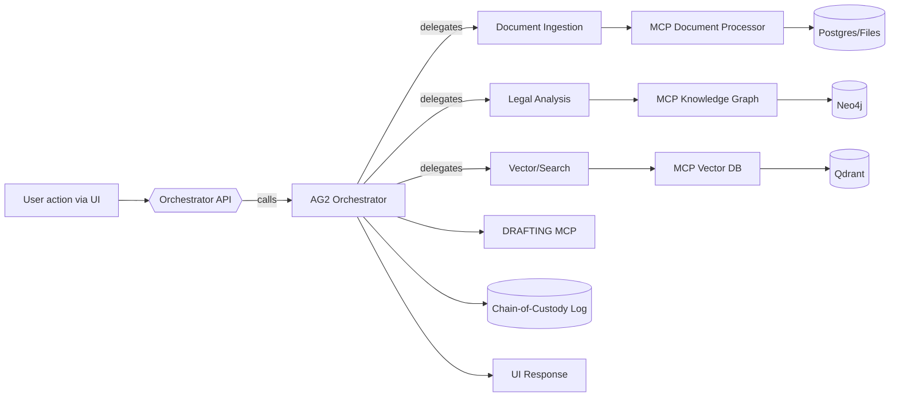
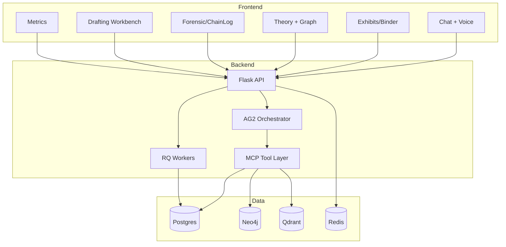

name: "AG2-Integrated Legal Discovery — PRD"
description: |
  Complete integration of the Legal Discovery application with Autogen 2 (AG2),
  MCP-wrapped tools, and a high-polish neon/glass UI. Deliver end-to-end slices:
  chat/orchestrator, ingestion, vector, theory graph, forensic logging, drafting
  (including responsive declarations to RFO move-away requests), metrics.

---

## Executive Summary
### Problem Statement
Litigation teams need a unified, traceable discovery and drafting platform that turns scattered documents and facts into strategy and filings, quickly and defensibly.

### Solution Overview
Fuse current Legal Discovery features with AG2 multi-agent orchestration and MCP tools. Add Neo4j-powered legal theory mapping, Qdrant vector search, immutable chain-of-custody, and a responsive, accessible, “badass” UI.

### Success Metrics
- Triage-to-draft time reduced by 50% for common motions.
- ≥ 95% ingestion success with idempotent vector/graph upserts.
- < 300ms P50 vector queries; < 2s orchestrated chat first-token.
- Chain-of-custody coverage at 100% of ingest/modify/export events.

## User Stories & Scenarios
1) As a litigator, I ask the system to draft a responsive declaration to an RFO (move-away) and receive a structured draft with citations in minutes.
2) As a paralegal, I ingest exhibits, ensure Bates stamping and hashing, and export a binder while preserving audit logs.
3) As a trial strategist, I explore a theory graph linking facts→elements→causes to spot gaps and opportunities.

### Primary User Flow

## Technical Architecture

## API Specifications (Overview)
- `POST /api/agents/orchestrate` — delegate to AG2; returns structured tool results.
- `POST /api/exhibits` + CRUD — ingest, hash, Bates, manage exhibits.
- `POST /api/binder` — enqueue binder build; status polling.
- `GET/POST /api/theories` — suggest, graph views, accept/reject links.
- `GET /api/forensics/chainlog` — immutable event stream.
- `GET /api/metrics` — service/component metrics.
- `GET /api/vector/count`, `POST /api/vector/query` — counts and search.
- `GET /api/drafting/available`, `POST /api/drafting/generate`, `POST /api/drafting/export` — drafting flows.

## Data Models (Highlights)
- ChainLog: { id, ts, actor, action, target, hash, meta }
- Theory: CauseOfAction, Element, Fact nodes with relationships.
- Vector payloads: { doc_id, chunk_id, case_id, page, source }.

## Implementation Phases
1. AG2 Orchestrator + MCP wiring; orchestrator endpoint + timing logs.
2. Ingestion pipeline + chain-of-custody; Qdrant normalization; vector count.
3. Theory graph endpoints + Neo4j idempotent upserts; suggestions.
4. Drafting workbench + RFO responsive declaration templates and MCP bridge.
5. Metrics, health timings; JWT/RBAC for mutating endpoints.
6. Neon/glass UI: chat, exhibits, theory graph, drafting editor, dashboards.

## Risks & Mitigations
- OCR/Extraction latency → parallelize pages, retry policy, cache.
- Vector/Graph inconsistency → deterministic collection names, MERGE, idempotent upserts.
- Security → JWT guardrails, audit logs, PII minimization.
- Windows paths → normalize, avoid hard-coded separators.

## Success Metrics (Detailed)
- Draft quality: ≥ 3 source citations per draft, user-edit < 20% lines.
- Graph UX: suggestion accept rate ≥ 30%; navigation latency < 200ms.
- Chain-of-custody completeness: 100% of mutating actions logged.

